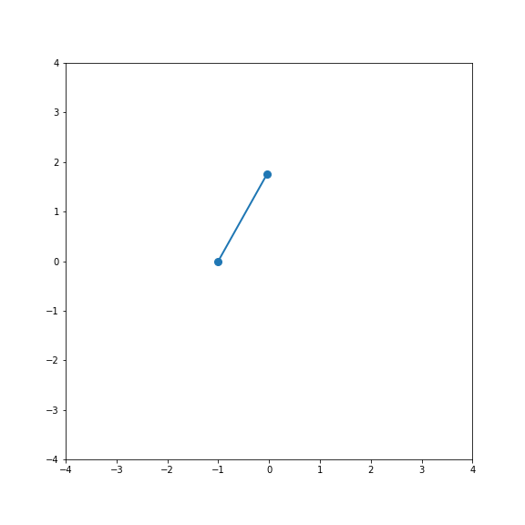

# Semestral work for subject OPSR (Optimal and Predictive Control) in ČVUT FS

Semestral work on inverted pendulum control, executed in jupyter notebook and matlab

## Project structure: 

├───matlab_sem  
│   └───pendulum.mlx (Matlab file implementing control of continuous model of inverted pendulum with LQR,MPC) 
│   └───JMPC.m       (Matlab function implementing criterial function to minimize)  
├───pendulum_sem.pdf            (pdf generated from pendulum.mlx)  
├───semestralka_jupyter.ipynb   (Jupyter file implementing control of continuous model of inverted pendulum via LQR + animation of control) 

## System:

Equations of system and it's linearization were taken from [1], [2]

## Work in Jupyter Notebook: 

semestralka_jupyter.ipynb implements control of inverted pendulum continuous system with LQR regulator and implements animation of regulation process

## Work in Matlab: 

pendulum.mlx implements control of inverted pendulum continuous system with LQR and MPC regulators

## Example of regulation:

 / ! 

## Sources: 
[1] - https://www.youtube.com/watch?v=1_UobILf3cc&list=PLQboW6x--OK3bgcxSxIYivYG0FfkqPYtT&index=3&t=613s&ab_channel=SteveBrunton 

[2] - Data Driven Science & Engineering Machine Learning, Dynamical Systems, and Control; Steven L. Brunton; J. Nathan Kutz  
